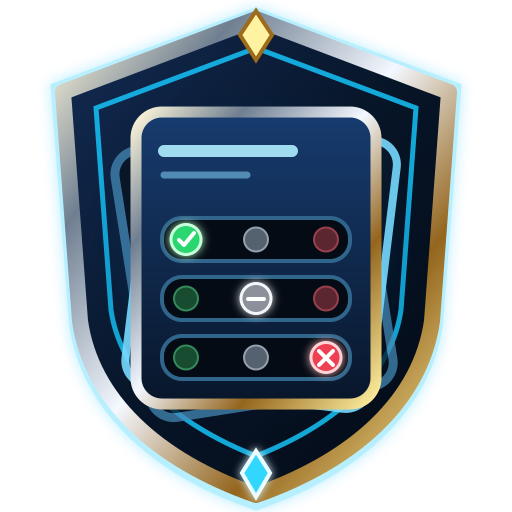

# Sentinel Profiles

<p align="center">
  
</p>

Sentinel Profiles is a standalone Dalamud plugin for creating named, manually
applied plugin configurations. It discovers the user's installed plugins at
runtime and gives every plugin one of three literal states:

- **Enable** — ensure the plugin is loaded when the profile is applied.
- **Leave Alone** — do not change the plugin's current state.
- **Disable** — ensure the plugin is unloaded when the profile is applied.

Profiles are switches, not continuous enforcement. After applying one, users
remain free to change plugins manually. Sentinel Profiles remembers the last
profile applied and reports whether its explicitly managed plugins still match.

## Features

- Discovers installed plugins dynamically from Dalamud's public
  `IDalamudPluginInterface.InstalledPlugins` API.
- Uses stable plugin `InternalName` values for persistence and reconnects rules
  automatically when a missing plugin is reinstalled.
- Preserves missing-plugin rules and shows them as **Missing / Not Installed**.
- Uses a clear segmented **Enable | Leave Alone | Disable** editor alongside a
  separately displayed live enabled/disabled state.
- Supports search, managed/state/missing filters, multi-select, and bulk edits.
- Creates Blank Profiles, independent duplicates, and full Capture Current
  Setup snapshots.
- Applies required disables first, then required enables, verifies every
  transition, and continues after individual failures.
- Reports enabled, disabled, already-correct, left-alone, missing, unsupported,
  and failed results without rolling back successful changes.
- Detects drift only from explicit Enable/Disable rules. Leave Alone never
  contributes to drift.
- Protects `SentinelProfiles` from being configured for self-unload. The safety
  policy is centralized so more protected InternalNames can be added later.
- Never edits another plugin's settings.

## Commands

- `/sprofiles` — open or toggle the main window
- `/sprofiles apply <profile name>` — apply a profile (quotes are optional)
- `/sprofiles reapply` — reapply the last-applied profile
- `/sprofiles list` — list saved profiles
- `/sprofiles help` — show command help

The graphical interface is the primary workflow; commands are optional.

## Creating and applying a profile

1. Run `/sprofiles` and choose **New Profile**.
2. Choose **Create Blank Profile** for a focused profile where everything starts
   as literal Leave Alone. This is the recommended normal mode.
3. Alternatively, choose **Capture Current Setup** to record every installed
   plugin. This creates an intentionally aggressive full snapshot.
4. Click Enable, Leave Alone, or Disable for the desired installed-plugin rows.
5. Click **Apply _Profile Name_**. Editing alone never changes live plugins.
6. Use **Reapply Profile** if the status later reports **Modified / Drifted**.

## Switching implementation and compatibility

Dalamud API 15 publicly exposes installed-plugin discovery and state change
events, but `IExposedPlugin` does not expose load or unload methods. Sentinel
Profiles therefore isolates switching behind `IPluginRuntime` and uses Dalamud's
native public temporary commands:

- `/xldisableplugintemp "InternalName"`
- `/xlenableplugintemp "InternalName"`

These commands apply an ephemeral override through Dalamud's own collection
manager, then load or unload the plugin. They intentionally do **not** rewrite
the user's persistent native collection definitions. Overrides reset when the
game restarts or when the plugin's state is changed in Dalamud's installer; the
stored Sentinel Profile remains available to apply again, and drift status
truthfully reflects the current live state.

Every transition is dispatched on the framework thread and must be confirmed by
Dalamud's `ActivePluginsChanged` event plus the public `IsLoaded` state within a
bounded timeout. Missing commands, API changes, rejected operations, timeouts,
and exceptions fail safely and are reported without crashing or stopping
unrelated transitions.

Plugins that declare `SupportsProfiles = false`, are banned, outdated,
decommissioned, or orphaned are visibly marked unsupported. A plugin assigned to
multiple native Dalamud collections can be rejected by Dalamud's native command;
API 15 does not expose collection membership for arbitrary installed plugins, so
Sentinel Profiles identifies that condition through a verified timeout and
directs the user to `/xllog` for Dalamud's exact native error.

The public manifest surface is marked for change in a future Dalamud API. If
Dalamud changes or removes it, the adapter is expected to fail closed until it is
updated; profile data and the rest of the UI remain isolated from that risk.

## Building

Requirements:

- .NET 10 SDK
- XIVLauncher/Dalamud API 15 development files

```powershell
dotnet restore SentinelProfiles.csproj --locked-mode
dotnet run --project SentinelProfiles.Core.Tests/SentinelProfiles.Core.Tests.csproj -c Release
dotnet build SentinelProfiles.csproj -c Release --no-restore
```

The installable package is written to:

```text
bin/Release/SentinelProfiles/latest.zip
```

## Architecture

- `Models/` — serializable profile, sparse tri-state entry, configuration, and
  installed-plugin snapshots.
- `Core/ProfileService.cs` — profile creation, capture, rename, duplicate,
  deletion, normalization, and case-insensitive name rules.
- `Core/ProfileApplicationEngine.cs` — testable planning, disable-before-enable
  execution, failure isolation, and final verification.
- `Core/DriftDetector.cs` — literal explicit-rule matching.
- `Services/InstalledPluginDiscoveryService.cs` — dynamic Dalamud inventory.
- `Services/NativeCommandPluginRuntime.cs` — isolated switching compatibility
  boundary with no reflection or internal Dalamud type references.
- `Services/ApplicationCoordinator.cs` — lifecycle, progress, results, and
  shutdown cancellation.
- `UI/MainWindow.cs` — profile list, editor, bulk controls, status, and reports.
- `SentinelProfiles.Core.Tests/` — dependency-free executable core test suite.

## Project boundaries

This repository owns Sentinel Profiles source, workflows, assets, and release
packages. The shared `MarshalTitan/Sentinel` repository remains only the central
Dalamud catalog and receives exactly one `SentinelProfiles` object.

## AI development disclosure

The initial implementation was created with substantial AI assistance. The
core logic and release package are automatically tested, but live in-game
validation is still required for the current Dalamud build and each user's
installed-plugin set.
